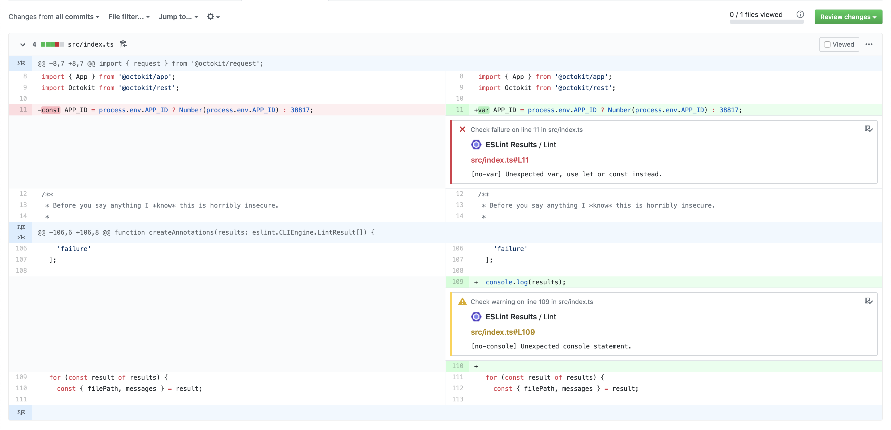

<div align="center">
  
  <h1>eslint-formatter-github</h1>
  <p>See ESLint errors and warnings directly in pull requests.</p>
</div>

## Highlights

- Report your eslint results as annotations using the [GitHub Checks API](https://developer.github.com/v3/checks/)
- Only runs in CI environment
- Uses [eslint-formatter-pretty](https://github.com/sindresorhus/eslint-formatter-pretty) as the formatter for displaying the lint results



## Install

```sh
npm install --save-dev eslint-formatter-github
# or
yarn add -D eslint-formatter-github
```

## Usage

You will need to install [the github app](https://github.com/apps/eslint-results) to your repo.

Then just use the formatter and it will report errors and warnings on PRs!

```sh
eslint --format github file.js
```

## Using you own GitHub App

You might not want to use our github app for the formatter.

Reasons:

1. You think they way we exposed the keys is bad
2. You are on Github Enterprise and cannot use the public app

In these situations all you need to do is set a few environment variables.

- `APP_ID` - Your GitHub application's ID
- `PRIVATE_KEY` - The private RSA key for your application
